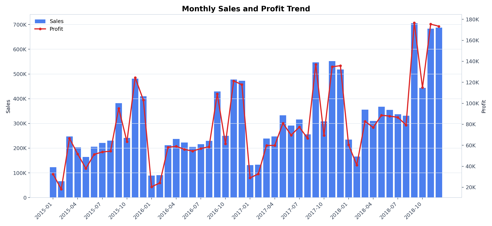
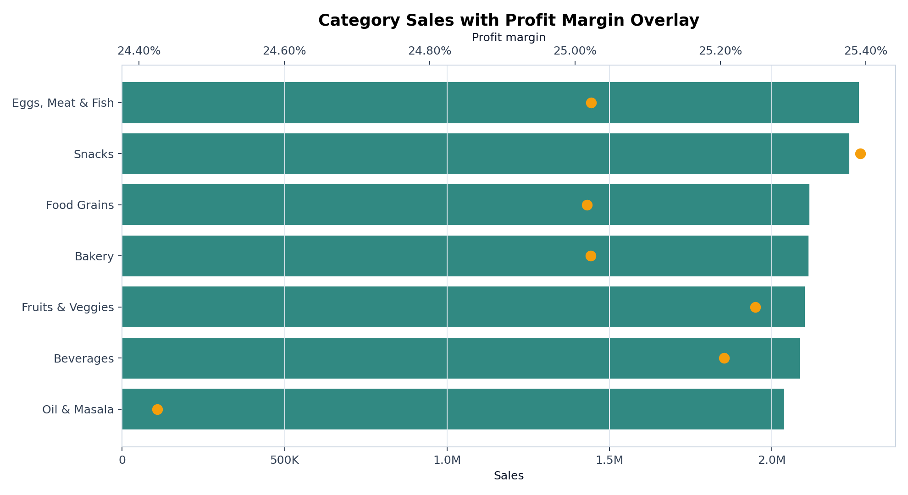
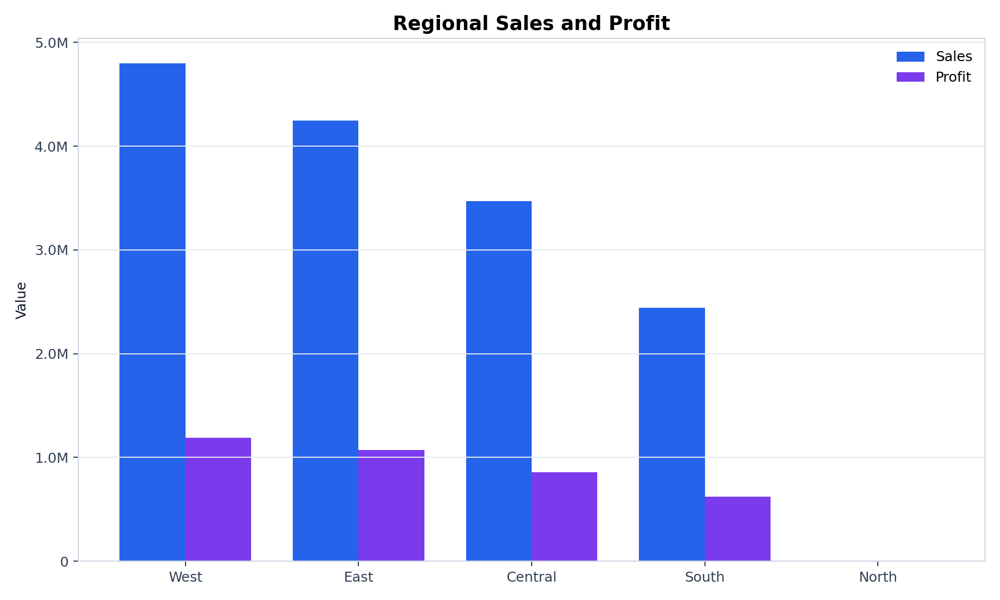
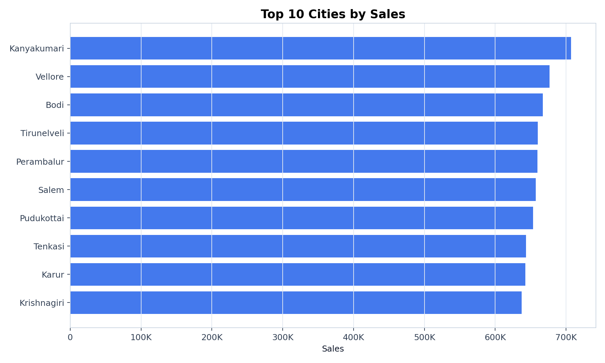
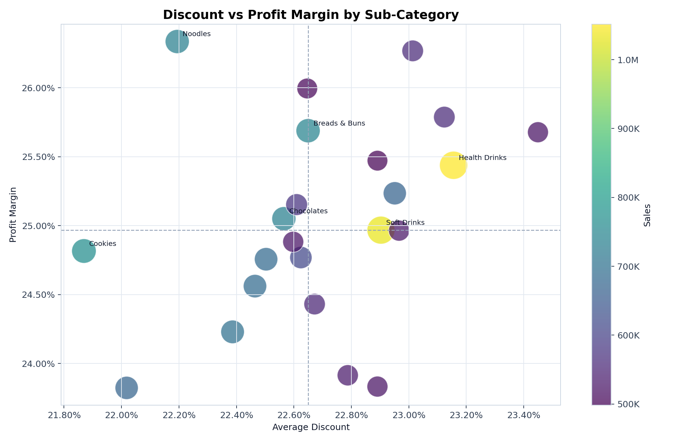

## Executive Summary

This report evaluates **9,994 Supermart grocery orders** from **2015-01-03 to 2018-12-30** across 5 regions and 24 cities in Tamil Nadu. The business generated **$14.96M in sales** and **$3.75M in profit**, producing an overall profit margin of **25.1%**.

The strongest commercial pattern is broad, balanced category contribution: no single category dominates revenue, and most categories sit near a 24-25% margin band. This makes the business less dependent on one product family, but it also means margin improvement must come from targeted sub-category, supplier, pricing, and discount decisions rather than a single obvious category shift.

## KPI Snapshot

| Metric | Value |
| --- | ---: |
| Orders | 9,994 |
| Unique customers | 50 |
| Total sales | $14,956,982 |
| Total profit | $3,747,121 |
| Profit margin | 25.1% |
| Average order value | $1,497 |
| Average discount | 22.7% |

## Data Quality

- No missing values were found in the required analytical fields.
- No duplicate rows were found.
- `Order Date` uses mixed separators (`-` and `/`). The analysis normalizes separators and parses dates using month-first convention because slash values such as `4/15/2018` are unambiguous.
- The dataset covers Tamil Nadu only.
- North has only 1 order, so region margin comparisons involving North should be treated as directional only.

## Sales And Profit Trend

Sales increased meaningfully over the four-year period, with 2018 producing the highest yearly sales and profit. Profit generally follows sales, which suggests no major deterioration in profitability as volume grows.

## Category Performance

**Eggs, Meat & Fish** is the largest category by sales, contributing **$2.27M** and **15.2%** of total sales. **Snacks** has the strongest category-level margin at **25.4%**, while **Oil & Masala** has the lowest category margin at **24.4%**.

| Category | Orders | Sales | Profit | Margin | Avg Discount |
| --- | ---: | ---: | ---: | ---: | ---: |
| Eggs, Meat & Fish | 1,490 | $2,267,401 | $567,357 | 25.0% | 22.8% |
| Snacks | 1,514 | $2,237,546 | $568,179 | 25.4% | 22.2% |
| Food Grains | 1,398 | $2,115,272 | $529,163 | 25.0% | 22.9% |
| Bakery | 1,413 | $2,112,281 | $528,521 | 25.0% | 22.5% |
| Fruits & Veggies | 1,418 | $2,100,727 | $530,400 | 25.2% | 22.9% |
| Beverages | 1,400 | $2,085,313 | $525,606 | 25.2% | 23.0% |
| Oil & Masala | 1,361 | $2,038,442 | $497,895 | 24.4% | 22.5% |

## Regional Performance

The West region leads both sales and profit, generating **$4.80M in sales** and **$1.19M in profit**. South has the highest margin among meaningful-volume regions at **25.6%**, but its sales base is smaller.

## City Performance

**Kanyakumari** is the highest-sales city, generating **$706,764** across 459 orders. The top city list is relatively balanced, which suggests growth opportunities should be prioritized by city/category combinations rather than city alone.

## Discount And Margin Review

At sub-category level, the correlation between average discount and profit margin is **0.32**. Discounting does not appear uniformly harmful, but the relationship is not strong enough to justify broad discount expansion. The better action is to inspect high-sales, below-average-margin sub-categories and test pricing or supplier changes first.

## Recommendations

1. Protect availability in high-sales categories and cities, especially Eggs, Meat & Fish, Snacks, Kanyakumari, Vellore, and Bodi.
2. Review Oil & Masala pricing, procurement cost, and promotion depth because it has the lowest category margin.
3. Use region-specific tactics: scale West for revenue, study South for margin practices, and avoid over-reading North due to one order.
4. Review high-sales sub-categories with below-average margin before increasing discounts.
5. Refresh this report monthly using the pipeline output tables and dashboard layer.

## Project Assets

- Dashboard: `dashboard/index.html`
- Markdown report: `reports/supermart_sales_analysis.md`
- Summary tables: `outputs/tables/`
- Chart assets: `outputs/charts/`

